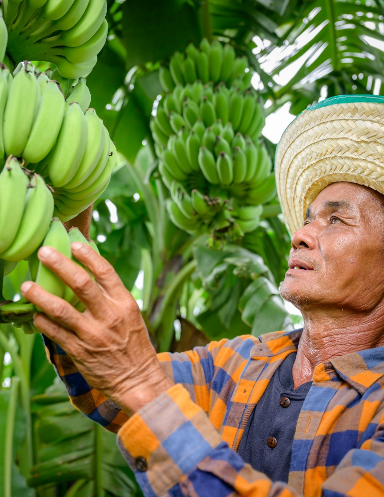

September 2026

<h1 class="cover-org">Trafigura Foundation</h1>

Digital Performance Report

<strong>Reporting period</strong> · September 2026

<strong>Prepared for</strong> · Trafigura Foundation

<strong>Report date</strong> · 2 October 2026

Made By UNE

<!-- 00 Goal -->

00

Goal of this report

This monthly report tells the story of how trafigurafoundation.org performed in September — and what we did to strengthen it.

We focus on four questions:

<ul>
<li><strong>What did we deliver?</strong> — the work completed on the site</li>
<li><strong>What went live?</strong> — new stories and pages published</li>
<li><strong>How did people respond?</strong> — search visibility, visits, and how the Foundation appears in AI answers</li>
<li><strong>What comes next?</strong> — priorities for October</li>
</ul>

September was a <strong>growth month on the base built in August</strong>: more visits and more clicks from Google, while we cleaned how pages share on social networks, published new stories, and kept the homepage fast.

<!-- 01 Work completed -->

01

Work completed

Delivery · September 2026

Site performance & technical SEO

<ul>
<li>Social previews cleaned across the site, so Facebook and LinkedIn no longer show the old “Established in 2007…” text</li>
<li>Tailored titles and descriptions on the new August pages, plus Puma Energy Fund and Against the Current</li>
<li>Homepage speed retested and held: about <strong>2 seconds</strong> to the main image on mobile</li>
<li>Guide for AI crawlers (<em>llms.txt</em>) updated to point at the public pages only</li>
</ul>

Structure & linking

<ul>
<li>Staff Engagement redesigned (voices and map) and the old duplicate address removed</li>
<li>Utility pages that only redirected visitors kept out of Google</li>
<li>Tales of Resilience stays live for people with the link, and stays out of search until the page is ready</li>
<li>Puma Energy Fund published as a short introduction with a link to pumaenergyfund.org</li>
</ul>

i

September’s work is what people notice when they share a page or land on Staff Engagement — and what they do not notice, because the homepage stayed fast. The remaining gap is the three stories published at the very end of the month: they are live, but still carry a generic description in Google.

<!-- 02 Content published -->

02

Content published

News & pages · September 2026

Four news stories and one new page went into the public sitemap. No new partner-story addresses were added.

<h3>News</h3>

| Story |
|---|
| Against the Current — staff rowing challenge |
| Breaking the Invisible Barrier |
| Generating revenue from conservation — coastal Kenya |
| When the Rain Stopped Coming — anticipatory action in Zimbabwe |

<h3>Pages</h3>

| Page |
|---|
| Puma Energy Fund |

<strong>Sitemap:</strong> 119 pages in total (9 core pages · 3 area pillars · 66 news · 41 partner stories). Tales of Resilience remains live but hidden from Google search.

What this means

These stories landed late in the month, so they barely show in September’s search numbers. Against the Current and Puma Energy Fund already have their own description. The other three still use the generic 2007 text — that is the first content task for October, before Google and social networks settle on the wrong snippet.

<!-- 03 Search -->

03

How people find Trafigura Foundation

Google Search Console · September 2026

| Measure | September | Δ vs August | Δ vs Sep 2025 |
|---|---:|---|---|
| Clicks from Google | 731 | +15.1% | +4.4% |
| Times shown in search | 44,700 | −14.1% | −14.1% |
| Click-through rate | 1.6% | +34.0% | +34.5% |
| Average position | 7.1 | Improved | Improved |

<h3>Top searches</h3>

| Search term | Clicks | What it tells us |
|---|---:|---|
| trafigura foundation | 302 | Core brand — people who already know the name |
| trafigura | 18 | Broad brand name; shown very often, clicked rarely |
| fondation trafigura | 13 | French-language brand demand |
| james josling | 11 | People looking up Foundation leadership |
| farringford foundation | 4 | Related organisation |
| blue catalyst fund | 2 | Partner name starting to bring search visits |

<h3>Top pages from Google</h3>

| Page | Clicks | Role |
|---|---:|---|
| Homepage | 383 | Main entry — about half of all search clicks |
| Who We Are | 163 | Strong second page — mission and identity |
| 2025 annual report site | 11 | People still looking for the report |
| Areas of Work | 11 | Pillar hub |
| Contact | 10 | People ready to get in touch |
| Programme manager vacancy | 9 | Recruitment search |

What this means

Google showed the site less often (−14% impressions) but more of those appearances turned into a visit. Click-through rate rose from about 1.2% to <strong>1.6%</strong>, and average position improved to <strong>7.1</strong>. Clicks are up both versus August (+15%) and versus September 2025 (+4%).

Search is still brand-led. Of the queries we can classify, <strong>344 clicks</strong> include “trafigura” and <strong>37</strong> do not. Non-brand discovery — partner names, themes, places — remains the longer-term growth lever. Who We Are is doing real work as the page after the homepage.

<!-- 04 Engagement -->

04

What visitors do on the site

Google Analytics 4 · September 2026

| Measure | September | Δ vs August | Δ vs Sep 2025 |
|---|---:|---|---|
| Total visits (sessions) | 3,200 | +16.7% | +41.7% |
| Visits from Google search | 1,200 | +33.1% | +21.4% |
| Engagement rate | 44.3% | Stable | −16.2% |
| Engaged visits | 1,400 | +15.6% | +18.7% |
| Average time on site | 4:28 | +45.3% | +54.0% |

What this means

Visits grew, and visits from Google grew faster than the site overall (+33% versus +17%). About one in three visits still comes from Google search. People also stayed much longer: average session duration is <strong>4 minutes 28 seconds</strong>, up 45% on August and 54% on last September.

The softer signal is engagement rate, flat this month but <strong>16% below September 2025</strong>. More people came, and they stayed longer, but a smaller share of sessions meet Google’s “engaged” bar than a year ago. Page views moved with the redesign: Staff Engagement <strong>+270%</strong> versus August, Contact +104%, Areas of Work +68%. The partners hub was quieter (−33%).

<!-- 05 AEO -->

05

Answer engines & AI visibility

AEO · September 2026

Journalists, partners, and researchers increasingly ask AI tools rather than scrolling search results. We want the Foundation described <strong>correctly</strong> and linked to <strong>your</strong> pages — not outdated copy or third-party summaries.

<h3>What we shipped</h3>

| Item | Status |
|---|---|
| Social and search descriptions cleaned of the 2007 boilerplate | Done |
| AI crawler guide updated to the public pages | Done |
| Tailored descriptions on new August pages, Puma, Against the Current | Done |
| Three end-of-month stories still on the generic description | October |
| FAQ section with short, quotable answers | Planned |
| Answer-first intros on the three pillar pages | Planned |

<h3>AI spot-check — score 6 / 6</h3>

Asked in ChatGPT on 2 October 2026. Each question scores one point if it cites the Foundation, and one point if the answer is accurate.

| Question | Cites your site? | Accurate? |
|---|---|---|
| What is the Trafigura Foundation? | Yes | Yes |
| What does the Trafigura Foundation fund? | Yes | Yes |
| What are the Foundation's areas of work? | Yes | Yes |

What this means

ChatGPT describes the Foundation correctly and points to your pages: an independent Swiss charity, funded by Trafigura, focused on climate adaptation, and working through three areas — Sustainable Livelihoods, Thriving Nature, and Prepared Communities. It also gets the practical rules right, including that the Foundation does not take unsolicited applications.

The remaining risk is the three new stories that still introduce the Foundation with the old generic sentence. A short FAQ on Who We Are, Our Approach, and Contact will give these tools a single quotable definition to reuse.

<!-- 06 Technical -->

06

Site speed & technical health

Homepage lab test · retested 22 September 2026

| Measure | August | September |
|---|---:|---:|
| Mobile performance score | 99 / 100 | <strong>98 / 100</strong> |
| Time to main content (mobile) | 2.0 seconds | <strong>2.0 seconds</strong> |
| Desktop performance | 100 / 100 | <strong>100 / 100</strong> |
| Time to main content (desktop) | 0.7 seconds | <strong>0.5 seconds</strong> |

What this means

The August speed work held. A one-point move from 99 to 98 is normal lab noise, not a regression. Mobile still reaches the main image in about two seconds, which is the threshold that keeps people on the page. No further speed project is needed in October unless a new homepage asset changes that.

<!-- 07 Summary -->

07

Summary & conclusion

September brought more visits and more clicks from Google, on a site that stayed fast and shared more cleanly.

731

Google clicks

+15.1% vs August

1.6%

Click-through rate

+34% vs August

3,200

Total visits

+16.7% vs August

2.0s

Load time (mobile)

held from August

In short

<ul>
<li><strong>Search:</strong> clicks up 15% versus August and 4% versus last September; the site was shown less often, but a higher share of those appearances were clicked</li>
<li><strong>Position:</strong> average rank improved to 7.1</li>
<li><strong>Visits:</strong> sessions up 17%; visits from Google up 33%; time on site up to 4:28</li>
<li><strong>Engagement:</strong> rate stable this month, still softer than September 2025</li>
<li><strong>Content:</strong> four news stories and the Puma Energy Fund page; sitemap now 119 pages</li>
<li><strong>Speed:</strong> homepage gains held (mobile 98, main content in 2.0s)</li>
<li><strong>AI visibility:</strong> ChatGPT described the Foundation accurately and cited your pages (6 / 6)</li>
</ul>

What this means

The site is being found and used more than in August, mostly by people who already search the Foundation by name. October should lock proper descriptions on the newest stories, then start the FAQ and the links from news to partner pages that help non-brand discovery.

<!-- 08 Plan -->

08

Plan for next month

October 2026

| Priority | Action | Why it matters |
|---|---|---|
| **High** | Tailored titles and descriptions for the three end-of-September stories | Stops Google and social shares using the old generic sentence |
| **High** | Short FAQ on Who We Are, Our Approach, and Contact | Gives AI tools a quotable, accurate definition |
| **Medium** | Answer-first introductions on the three pillar pages | Makes each area of work easy to cite |
| **Medium** | Links from news stories to the related partner page | Helps visitors and Google connect a story to the organisation behind it |
| **Medium** | Repeat the monthly AI spot-check | Confirms the Foundation is still described correctly |

What this means

October is about the words on the newest pages, and about being quoted accurately — not another round of speed work. Search is healthy and still brand-led; clearer answers and tighter links are how discovery grows beyond the name.

<!-- Thank you -->

Thank you

We look forward to continuing the work in October.

Trafigura Foundation · Digital Performance Report · September 2026

Made By UNE

